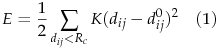
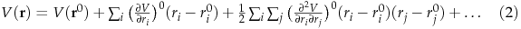
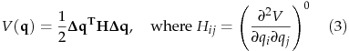
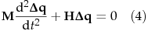
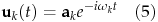
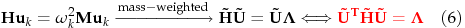

# EZ-NMA
Normal Mode Analysis with Elastic Network Model

### Principles of Normal Mode Analysis
In elastic network model, the potential is expressed as:

Moreover, the potential energy can be expanded as:

Here the system is assumed to be near equilibrium, thus the first order derivative is zero. The ground state energy can also be assigned as zero, thus only the second order derivative is left:

According to Newton's Law II, we have:

The general solution of this differential equations has the following form:

Plug this solution back to the equation, we have an eigenvalue problem. By matrix diagonalization, we can obtain the eigenvalue and eigenvectors (normal modes) of the system:

### Notes
- Both CPU and GPU implementations are preliminary and under testing and debugging. 

- A short demo of spastin is provided:

