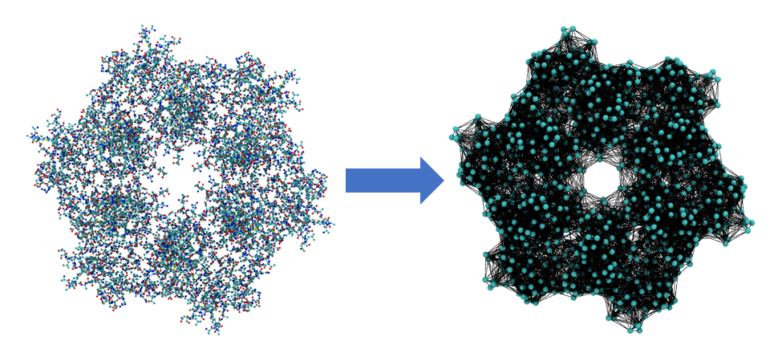

# EZ-NMA
Normal Mode Analysis with Elastic Network Model with GPU Acceleration


## Principles of Normal Mode Analysis
In elastic network model, each amino acid is represented as the CA bead (cyan sphere) connected by a spring (black line). 


The potential is expressed as:


Moreover, the potential energy can be expanded as:


Here the system is assumed to be near equilibrium, thus the first order derivative is zero. The ground state energy can also be assigned as zero, thus only the second order derivative is left:


According to Newton's Law II, we have:


The general solution of this differential equations has the following form:


Plug this solution back to the equation, we have an eigenvalue problem. By matrix diagonalization, we can obtain the eigenvalue and eigenvectors (normal modes) of the system:


## Example inputs
```
# Configuration file for EZNMA, comments lines start with "#"
      
#1 [job_name] as name prefix for output files.
# not mandatory, default is <ez-nma>
job_name	spastin-hexamer-gpu

#2 [nma_coor] specifies coordinates perform normal mode analysis
# madatory, need this to build Hessian array.
nma_coor	pdb/spastin-hexamer-without-mtbd-ordered.pdb

#3 [r_cutoff] specifies cutoff distance to build spring network.
# For ENM, r_cutoff is recommended to be set between 13 to 15A (Eyal 2006).
# not mandatory, default is 10.0
r_cutoff	12.0

#4 [n_modes] specifies numer of normal modes with lowest 
# frequencies (energies) needed to write.
# not mandatory, default is 10, maxium is 3*Natom
n_modes		100

#5 [ref_coor] specifies coordinates file to calculate overlap.
# not required if overlap calculation is not needed.
# ref_coor referce_coordiante.pdb

#6 [vmd_file] specifes file name to write tcl commands
# for visualization of spring network. this feature can be done using 
vmd_file   spring-network

#7 [tol] specifies the error tolerance to diagonalize Hessian
# matrix, default is 1e-6. It's not recommended for user to
# modify this value thus not shown here.
```

## Notes
- Both CPU and GPU implementations are preliminary and under testing and debugging. 

- A short demo of spastin is provided:


